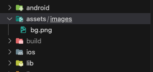
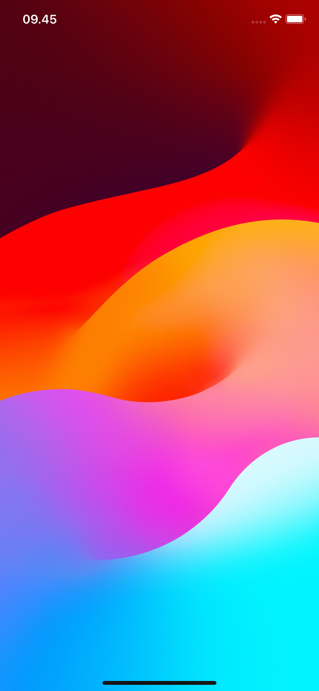

# Background Scafold

# Step 1

Buat folder assets di dalam project, kemudian di dalamnya buat lagi folder images. Di dalam images tambahkan gambar sebagai backround. Contonya bg.png di bawah ini

# Step 2

Buat file main.dart


import 'package:flutter/material.dart';
import 'package:tutorials/screens/home_screen.dart';

void main() {
  runApp(const MyApp());
}

class MyApp extends StatelessWidget {
  const MyApp({super.key});

  @override
  Widget build(BuildContext context) {
    return MaterialApp(
      debugShowCheckedModeBanner: false,
      title: 'Flutter Tutorials',
      theme: ThemeData(
        primarySwatch: Colors.blue,
      ),
      home: const HomeScreen(),
    );
  }
}


# Step 3

Buat folder screens dan file home_screen.dart di dalamnya


import 'package:flutter/material.dart';

class HomeScreen extends StatelessWidget {
  const HomeScreen({super.key});

  @override
  Widget build(BuildContext context) {
    return Scaffold(
      appBar: AppBar(
        iconTheme: const IconThemeData(color: Colors.white),
        backgroundColor: Colors.transparent,
        elevation: 0,
      ),
      extendBodyBehindAppBar: true,
      body: Stack(
        children: [
          Image.asset(
            'assets/images/bg.png',
            fit: BoxFit.cover,
            width: double.infinity,
            height: double.infinity,
          ),
        ],
      ),
    );
  }
}


# Step 4

Jalankan aplikasi

